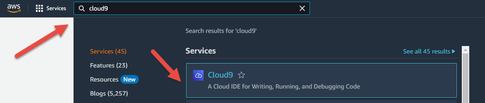
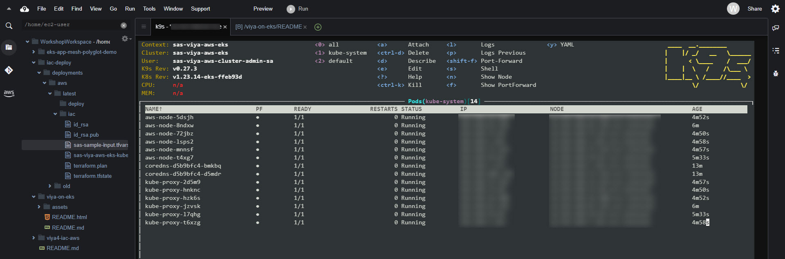

# SAS Viya on AWS AKS (deployment quickstart)

This deployment workshop will walk you through all steps of deploying SAS Viya on AWS EKS (Amazon Elastic Kubernetes Service). We'll start by setting up the AWS cloud infrastructure, then continue to install some required packages and finally deploy the SAS Viya software.

Let's briefly discuss the 3 steps:

* **AWS cloud infrastructure**. We will use the  SAS deployment framework found here: https://github.com/sassoftware/viya4-iac-aws . This framework uses Terraform (https://www.terraform.io/) to create all necessary infrastructure componts. In particular, we'll create:
    * an EKS cluster
    * a virtual machine running a NFS service (as a shared storage provider for SAS Viya)
    * and of course all the "glue" components required for this to work (networking, roles etc.)
* **Required packages**. SAS Viya requires some additional components to be able to run on Kubernetes. We'll need to deploy them before we can continue. We will install these components:
    * nginx ingress controller
    * NFS storage provisioner
    * cert-manager
    * metrics-server
* **SAS Viya**. We'll deploy SAS Viya using the "manual" approach where you will prepare and submit the YAML manifest which triggers the software installation process. For this you will need to become familiar with the `kustomize` tool (https://kustomize.io/). `kustomize` allows you to take the manifest templates shipped by SAS and merge them with site-specific input which you have to provide.


## Using the Cloud9 IDE

* After logging in to workshop studio (https://catalog.us-east-1.prod.workshops.aws/event/dashboard/en-US/workshop), click on the link in the left panel to open the AWS console
* Type "cloud9" into the search box at the top and select the "Cloud9" service link



* Now click on "Open" to launch the Cloud9 IDE

Let's first install a few helper utilities which we'll need later.

```shell
# verify that helm is installed
helm list -A

# verify that the docker runtime is installed
docker ps

# verify that kubectl is installed
kubectl version

# kustomize
opsys=linux
kvers=3.7.0
release_url=https://api.github.com/repos/kubernetes-sigs/kustomize/releases/tags/kustomize%2Fv${kvers}

curl -s $release_url |  grep browser_download.*${opsys}_${arch} |  cut -d '"' -f 4 |  sort -V | tail -n 1 |  xargs curl -sLO
tar xvzf kustomize_*_linux_amd64.tar.gz
sudo mv kustomize /usr/local/bin/
rm -f kustomize_*_linux_amd64.tar.gz

kustomize version

# yq
wget https://github.com/mikefarah/yq/releases/download/v4.30.8/yq_linux_amd64
chmod 755 yq_linux_amd64
sudo mv yq_linux_amd64 /usr/local/bin/yq

yq --version

# k9s - just for fun
wget https://github.com/derailed/k9s/releases/download/v0.27.3/k9s_Linux_amd64.tar.gz
tar xvzf k9s_Linux_amd64.tar.gz
sudo mv k9s /usr/local/bin/
rm -f k9s_Linux_amd64.tar.gz README.md LICENSE

k9s version
```

Finally clone this repository

```shell
# switch to this folder because it is shown in the file explorer panel
cd ~/environment/
git clone https://github.com/githje/viya-on-eks.git
```

You should now see a new folder named "viya-on-eks" in the file explorer on the left. Try to open the file README.md from this folder.


## 1. Create the AWS cloud infrastructure


### Prepare building the Terraform plan file

The SAS-provided IaC ("infrastructure-as-code") scripts use a local Docker container to prepare and run the Terraform scripts. First, let's clone the IaC repository.

```shell
# switch to this folder because it is shown in the file explorer panel
cd ~/environment/

git clone https://github.com/sassoftware/viya4-iac-aws.git --branch 5.4.0
cd viya4-iac-aws/
```

Now create the Docker container which we'll use to run the cloud infrastructure deployment script.

```shell
docker build . -t viya4-iac-aws:5.4.0

# verify that the container has been built successfully
docker images
```

You should see this output (note the first entry).

```
REPOSITORY            TAG       IMAGE ID       CREATED         SIZE
viya4-iac-aws         5.4.0     4a9fa50ad084   6 seconds ago   1.39GB
mikefarah/yq          latest    290cefa2b7ae   4 weeks ago     19.8MB
amazon/aws-cli        2.7.22    e0804ed12ef7   6 months ago    374MB
hashicorp/terraform   1.0.0     3ecccf079b62   20 months ago   106MB
```

The viya4-iac-aws container will be used twice: to create the Terraform plan file and to execute this plan. We need to set a few configuration parameters to make the plan suitable for this workshop.

```shell
# some variables for building names etc.
export iac_tag=5.4.0
export deployment_tag=6.1.0
export backup_date=$(date +%s)
export cloudprovider=aws

# create the project folders containing our customizations
mkdir -p /home/ec2-user/environment/iac-deploy
export IACHOMEDIR=/home/ec2-user/environment/iac-deploy

mkdir -p $IACHOMEDIR/deployments/$cloudprovider/old
mv $IACHOMEDIR/deployments/$cloudprovider/latest/ $IACHOMEDIR/deployments/$cloudprovider/old/$backup_date/
mkdir -p $IACHOMEDIR/deployments/$cloudprovider/latest/deploy
mkdir -p $IACHOMEDIR/deployments/$cloudprovider/latest/iac

export iac_dir=$IACHOMEDIR/deployments/$cloudprovider/latest/iac
export deploy_dir=$IACHOMEDIR/deployments/$cloudprovider/latest/deploy
```

By now you should have received a file containing some extra AWS credentials. We need to add this information to the plan file. The XML file containing the AWS credentials will look like this:

```json
{
    "AccessKey": {
        "UserName": "devops-iac",
        "AccessKeyId": "AAABBBCCC111222333",
        "Status": "Active",
        "SecretAccessKey": "abcdefgh12345",
        "CreateDate": "2023-02-12T21:41:11+00:00"
    }
}
```

We're interested in the `AccessKeyId` and `SecretAccessKey` values. Copy them into the following shell variables:

```shell
# do NOT copy&paste!
export APPID=AAABBBCCC111222333
export PASSWORD=abcdefgh12345
```

Create the credentials file needed by Terraform.

```shell
if [ ! -z $IACHOMEDIR/deployments/$cloudprovider/latest/.${cloudprovider}_docker_creds.env ]; then
echo "[INFO:] Creating credentials file"
cat << EOF > $IACHOMEDIR/deployments/$cloudprovider/latest/.${cloudprovider}_docker_creds.env
 TF_VAR_aws_access_key_id=$APPID
 TF_VAR_aws_secret_access_key=$PASSWORD
EOF
else
 echo "[INFO:] File already exists. Nothing to do"
fi

# verify that the information looks correct
cat $IACHOMEDIR/deployments/$cloudprovider/latest/.${cloudprovider}_docker_creds.env
```

More variables describing the cloud infrastructure.

```shell
export location=us-east-1
export prefix=sas-viya-aws
export tag='"user" = "sas"'
export postgres=internal
export registry=no
```

Finalizing the Terraform TFVARS file.

```shell
# using this template
curl https://raw.githubusercontent.com/sassoftware/viya4-iac-$cloudprovider/main/examples/sample-input.tfvars -o $iac_dir/sas-sample-input.tfvars

IP=$(dig @resolver1.opendns.com ANY myip.opendns.com +short)
CIDR=$(echo ${IP}/32 | sed 's/^/"/;s/$/"/')
echo "IP address of this VM: $IP"

sed -i "s|= \[\]|= \[ $CIDR \]|g" $iac_dir/sas-sample-input.tfvars

# crunchydata or external PG database?
if [ $postgres == "internal" ]; then
  sed -i '/postgres_servers = {/,+2d' $iac_dir/sas-sample-input.tfvars
fi

# use a mirror or not?
if [ $registry == "yes" ]; then
  sed -i "/create_container_registry/d" $iac_dir/sas-sample-input.tfvars
  sed -i "/container_registry_sku/i create_container_registry    = true" $iac_dir/sas-sample-input.tfvars
fi

sed -i "s/<prefix-value>/$prefix/g" $iac_dir/sas-sample-input.tfvars
sed -i "s/<aws-location-value>/$location/g" $iac_dir/sas-sample-input.tfvars
sed -i "s|~/.ssh/id_rsa.pub|/workspace/id_rsa.pub|g" $iac_dir/sas-sample-input.tfvars
sed -i "s/{ }/{ $tag }/g" $iac_dir/sas-sample-input.tfvars

# generate SSH key
ssh-keygen -t rsa -q -f "$iac_dir/id_rsa" -N "" <<< y

# verify results
cat $iac_dir/sas-sample-input.tfvars 
```


### Build the Terraform plan file and create the cloud infrastructure

Create the Terraform plan file.

```shell
docker run --rm \
  --env-file $IACHOMEDIR/deployments/$cloudprovider/latest/.${cloudprovider}_docker_creds.env \
  -v $iac_dir:/workspace:Z \
  viya4-iac-$cloudprovider:$iac_tag \
  plan -var-file /workspace/sas-sample-input.tfvars -out /workspace/terraform.plan
```

The command should end with the following output:

```
Saved the plan to: /workspace/terraform.plan

To perform exactly these actions, run the following command to apply:
    terraform apply "/workspace/terraform.plan"
```

Submit the plan file (build the cloud infrastructure). This will take around 20+ minutes. You will be able to watch the progress on the shell (and in the AWS console).

```shell
docker run --rm \
  --env-file $IACHOMEDIR/deployments/$cloudprovider/latest/.${cloudprovider}_docker_creds.env \
  -v $iac_dir:/workspace:Z \
  viya4-iac-$cloudprovider:$iac_tag \
  apply --auto-approve -state /workspace/terraform.tfstate /workspace/terraform.plan
```

The command should end with the following output:

```
Apply complete! Resources: 100 added, 0 changed, 0 destroyed.

Outputs:

autoscaler_account = "arn:aws:iam::622837347326:role/sas-viya-aws-cluster-autoscaler"
cluster_api_mode = "public"
...
```


### Validate that you can connect to the new EKS cluster

```shell
sudo chown $(id -u):$(id -g) $iac_dir/${prefix}-eks-kubeconfig.conf 
sudo chmod 600 $iac_dir/${prefix}-eks-kubeconfig.conf

export KUBECONFIG=$iac_dir/${prefix}-eks-kubeconfig.conf
kubectl get nodes
```

The command output should look like this:

```
NAME                             STATUS   ROLES    AGE     VERSION
ip-192-168-xx-xxx.ec2.internal   Ready    <none>   3m28s   v1.23.15-eks-49d8fe8
ip-192-168-xx-xxx.ec2.internal   Ready    <none>   3m34s   v1.23.15-eks-49d8fe8
ip-192-168-xx-xxx.ec2.internal   Ready    <none>   4m9s    v1.23.15-eks-49d8fe8
ip-192-168-xx-xxx.ec2.internal   Ready    <none>   4m36s   v1.23.15-eks-49d8fe8
ip-192-168-xx-xxx.ec2.internal   Ready    <none>   3m26s   v1.23.15-eks-49d8fe8
ip-192-168-xx-xxx.ec2.internal   Ready    <none>   3m33s   v1.23.15-eks-49d8fe8
```

Also, check the EKS landing page in the AWS console (https://us-east-1.console.aws.amazon.com/eks/home?region=us-east-1#/clusters). And try this - just for fun (CTRL-C to exit).

```shell
k9s
```



This concludes the 1st step. We'll now deploy some required 3rd-party packages.


## 2. Deploy required infrastructure components

SAS Viya requires the nginx ingress controller (https://github.com/kubernetes/ingress-nginx), which is not installed yet. We'll install it using helm.

```shell
helm repo add ingress-nginx https://kubernetes.github.io/ingress-nginx
helm repo update

# list all versions
# helm search repo ingress-nginx --versions

# make nginx use host network (uses port 80 and 443)
helm install ingress-nginx ingress-nginx/ingress-nginx --version 4.4.2 \
    --set controller.hostNetwork=true,controller.service.type="",controller.kind=DaemonSet

helm install nginx-ingress ingress-nginx/ingress-nginx --version 4.4.2 \
    --namespace nginx \
    --create-namespace \
    --set controller.service.type=LoadBalancer

# check version
POD_NAME=$(kubectl -n nginx get pods -l app.kubernetes.io/name=ingress-nginx -o jsonpath='{.items[0].metadata.name}')
kubectl -n nginx exec -it $POD_NAME -- /nginx-ingress-controller --version

# get the ingress-class name, should return: nginx
kubectl -n nginx get IngressClass -o yaml | yq .items[0].metadata.name

# get the service details
ELB_DNS=$(kubectl -n nginx get service nginx-ingress-ingress-nginx-controller -o yaml | \
  yq .status.loadBalancer.ingress[0].hostname)

echo "Hostname of LoadBalancer: $ELB_DNS"

# quick check - this returns 404 (nginx default backend)
curl -k https://$ELB_DNS
```

(Optional) Deploy a simple web application to test web-based access to the cluster

```shell

```


## 3. Deploy SAS Viya

